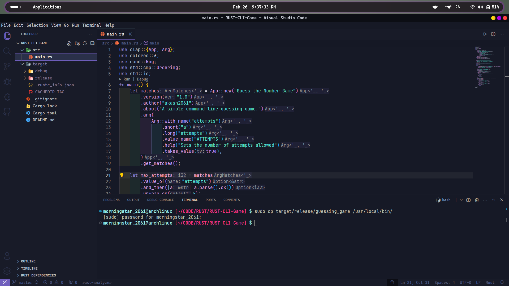
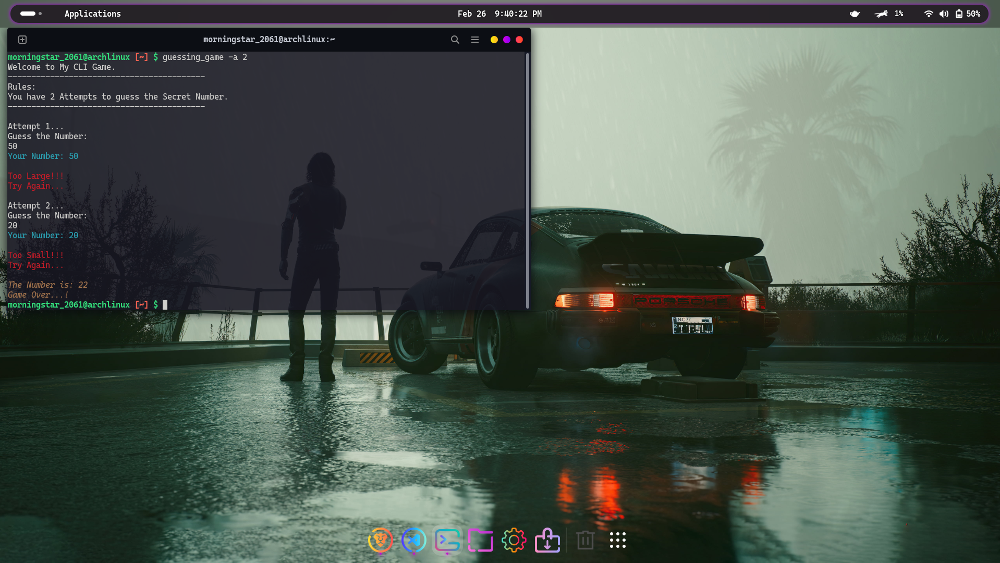

# Guessing The Number Game 

### Welcome to my first Rust project! 🦀

## Description
This repository hosts my first Rust project - a simple "Guessing the Number" game. It serves as an introduction to Rust programming, providing a hands-on experience with its syntax and features.

## Game as CLI-Tool:

## Version & Help:

## Game in Action:

## Features
- Interactive Game: Engage in a basic and entertaining number guessing game.
- Rust Fundamentals: Explore the fundamentals of Rust programming language.
- Beginner-Friendly: Ideal for those starting their journey with Rust.

# How to Play 🚀

# License

This Project is licensed under the [MIT License](LICENSE).
