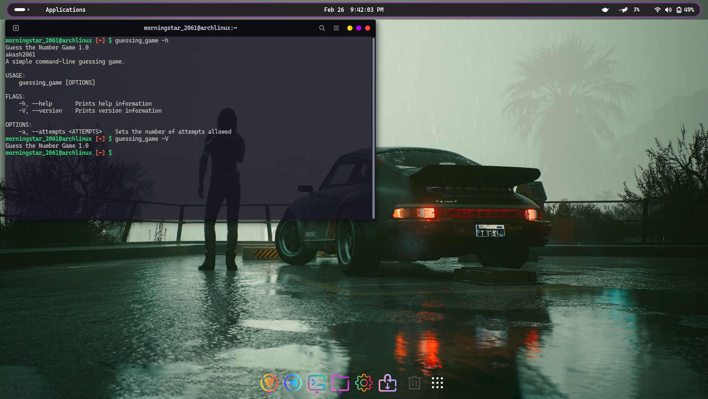

# Guessing The Number Game 

### Welcome to my first Rust project! 🦀

## Description
This repository hosts my first Rust project - a simple "Guessing the Number" game for Linux Terminals. It serves as an introduction to Rust programming, providing a hands-on experience with its syntax and features.

## Game as CLI-Tool:


## Version & Help:


## Game in Action:

## Features
- Interactive Game: Engage in a basic and entertaining number guessing game.
- Rust Fundamentals: Explore the fundamentals of Rust programming language.
- Beginner-Friendly: Ideal for those starting their journey with Rust.

## Crates Used:
+ rand = "0.8.5"
+ colored = "2.1.0"
+ clap = "2.33.0"

# How to Play 🚀

### Download and Install:

1. Go to the [Releases](https://github.com/akash2061/RUST-CLI-Game/releases) page or Directly [Download](https://github.com/akash2061/RUST-CLI-Game/releases/download/v1.0/guessing_game).
2. Download the latest release for your platform.
3. Open your terminal and navigate to the folder where the executable is downloaded.
4. Copy the executable to the `/usr/local/bin` directory using the following command:

    ```bash
    sudo cp ./guessing_game /usr/local/bin/
    ```

Now you can run the game from any terminal window by simply typing its name `guessing_game`, thanks to its location in `/usr/local/bin`.


Feel free to explore the code, share feedback, or contribute to enhancing this small Rust project. Happy coding!

# License

This Project is licensed under the [MIT License](LICENSE).
